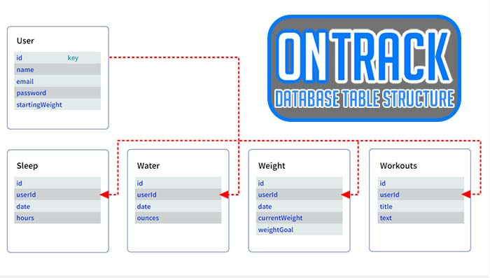

## Description

This application caters to individuals dedicated to cultivating a more health-conscious lifestyle. Users can initiate their journey by signing in using their email and password. Upon accessing the application, a comprehensive goal-setting feature enables users to establish their current weight and desired weight goal, generating a progress bar that visually depicts their proximity to achieving their desired objective. Furthermore, the application empowers users to input their daily water intake and hours of sleep, facilitating the creation of two distinct charts that visually represent their past and present data, allowing for easy analysis and tracking of personal trends.

We have developed this application with the dual purpose of fostering personal motivation and inspiring others to pursue a healthier lifestyle. By effectively monitoring and recording vital information, it addresses the common challenge of consistently documenting weight, water intake, and sleep patterns. Through a simple sign-in process, users gain access to their personal accounts, enabling them to effortlessly log their daily progress and maintain a comprehensive record of their health-related data. This streamlined approach eliminates the need for manual note-taking and ensures that users can effortlessly track and monitor their vital metrics.

## Table of Contents

- [Installation](#installation)
- [Usage](#usage)
- [Credits](#credits)
- [License](#license)
- [Wireframe](#wireframe)

## Installation

1. Firstly, clone the repository to your local computer.

2. Open up the terminal and type in: npm i which will download all the needed packages.

3. Open up the terminal and create the database. Run command: mysql -u root -p then enter in your password.

4. Run command: ./db/schema.sql to create the database.

5. Run command: quit to get out of mysql.

6. Run command: npm run seed which will allow you to populate the database from your CLI.

7. Run command: npm start to run the server file which will be listening at localhost:3001 

## Usage

1. When you open up the server, you will be shown to either sign in or sign up, you should choose the latter.

2. Then you will be redirected to the goals page where you can input information for weight, sleep, and water.

3. After inputting your data, you can click on 'tracker' which will then proceed to show you a progress bar, a chart for sleep, and another chart for water intake. 

## Wireframe

Here is our initial wireframe for our login, registration, and logged in pages:

Here is the layout of our database tables:

## Credits

1. Lodash Node Module Package Sources (Kevin):

    1. Documentation: https://www.npmjs.com/package/lodash

    2. 'Random' Documentation: https://github.com/lodash/lodash/blob/4.17.21-npm/random.js 

    3. CDN Documentation: https://www.jsdelivr.com/package/npm/lodash 

2. I used the mdn web docs page "Document: DOMContentLoaded event" to figure out how to get my javascript to run every time the page loads (Kevin).  Here is a link to the article: https://developer.mozilla.org/en-US/docs/Web/API/Document/DOMContentLoaded_event 

3. I found free use images on unsplash.com under the Unsplash License to use for our random background images (Kevin).  Here are links to the original files:

      1. Photo Credit to Samantha Gades: https://unsplash.com/photos/k95uqdEe8R4 
      
      2. Photo Credit to Victor Freitas: https://unsplash.com/photos/Yuv-iwByVRQ

      3. Photo Credit to Kelly Sikkema: https://unsplash.com/photos/IZOAOjvwhaM 

      4. Photo Credit to Victor Freitas: https://unsplash.com/photos/WvDYdXDzkhs

      5. Photo Credit to Sven Mieke: https://unsplash.com/photos/jO6vBWX9h9Y

      6. Photo Credit to Alexander Redl: https://unsplash.com/photos/d3bYmnZ0ank

4. I Used the Bootstrap CSS Framework to build the HTML (Kevin).  Here is a link to the documentation: https://getbootstrap.com/docs/5.1/getting-started/introduction/ 

5. I used Google Fonts to bring in Poppins (Kevin).  Here is a link to the font: https://fonts.google.com/specimen/Poppins 

6. I found an article on w3schools that showed me how to create a progress bar.  Here is the link to the article: https://www.w3schools.com/howto/howto_js_progressbar.asp

7. I learned how to create a favicon using javascript from spemer.com.  Here is a link to the article: https://spemer.com/articles/set-favicon-with-javascript.html 

8. Stack Overflow article led me to the documentation to figure out how to use operators (Kevin): https://stackoverflow.com/questions/43115151/sequelize-query-to-find-all-records-that-falls-in-between-date-range 

9. Sequelize Operators Documentation to figure out how to find the data in a date range using Op.between (Kevin): https://sequelize.org/docs/v6/core-concepts/model-querying-basics/ 

10. This documentation on moment.js helped with the correct method of subtracting(Kevin): https://momentjs.com/guides/#/warnings/js-date/

11. The video "Beautiful Chart Animation with Chart.js Tutorial" helped me with understanding how to animate chart.js (Kevin): https://www.youtube.com/watch?v=fqARSwfsV9w

12. We are using the Chart.js library for our Sleep and Water visuals.  Here is a link to the documentation (Kevin): https://www.chartjs.org/docs/latest/getting-started/installation.html 

13. Sequelize Operator Docs used (Kevin): https://sequelize.org/docs/v6/core-concepts/model-querying-basics/ 

14. I found an article called "Sequelize Where Statement with date" on Stack Overflow and the answer from user "Evan Siroky" gave me the idea of using the gte operator and moment.js to get 7 days of data for the chart display.  Here is a link to the page (Kevin): https://stackoverflow.com/questions/29798357/sequelize-where-statement-with-date

15. The 14-28 Student Mini-Project assignment served as inspiration for setting up the server and routes to get us started.

## License

MIT License

Please refer to the LICENSE file in the repository for more information.

## Features

If your project has a lot of features, list them here.
