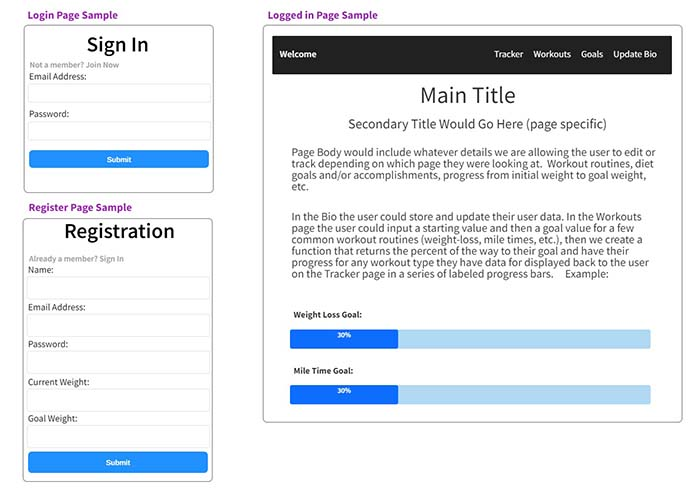

## Description

Provide a short description explaining the what, why, and how of your project. Use the following questions as a guide:

- What was your motivation?
- Why did you build this project? (Note: the answer is not "Because it was a homework assignment.")
- What problem does it solve?
- What did you learn?

## Table of Contents

- [Installation](#installation)
- [Usage](#usage)
- [Credits](#credits)
- [License](#license)

## Installation

What are the steps required to install your project? Provide a step-by-step description of how to get the development environment running.

## Usage

Here is our initial wireframe for our login, registration, and logged in pages:

We will add additional screenshots here once they are ready.

Provide instructions and examples for use.

## Credits

1. Lodash Node Module Package Sources (Kevin):

    1. Documentation: https://www.npmjs.com/package/lodash

    2. 'Random' Documentation: https://github.com/lodash/lodash/blob/4.17.21-npm/random.js 

    3. CDN Documentation: https://www.jsdelivr.com/package/npm/lodash 

2. I used the mdn web docs page "Document: DOMContentLoaded event" to figure out how to get my javascript to run every time the page loads (Kevin).  Here is a link to the article: https://developer.mozilla.org/en-US/docs/Web/API/Document/DOMContentLoaded_event 

3. I found free use images on unsplash.com under the Unsplash License to use for our random background images (Kevin).  Here are links to the original files:

      1. Photo Credit to Samantha Gades: https://unsplash.com/photos/k95uqdEe8R4 
      
      2. Photo Credit to Victor Freitas: https://unsplash.com/photos/Yuv-iwByVRQ

      3. Photo Credit to Kelly Sikkema: https://unsplash.com/photos/IZOAOjvwhaM 

      4. Photo Credit to Victor Freitas: https://unsplash.com/photos/WvDYdXDzkhs

      5. Photo Credit to Sven Mieke: https://unsplash.com/photos/jO6vBWX9h9Y

      6. Photo Credit to Alexander Redl: https://unsplash.com/photos/d3bYmnZ0ank

4. I Used the Bootstrap CSS Framework to build the HTML (Kevin).  Here is a link to the documentation: https://getbootstrap.com/docs/5.1/getting-started/introduction/ 

5. I used Google Fonts to bring in Poppins (Kevin).  Here is a link to the font: https://fonts.google.com/specimen/Poppins 

6. I found an article on w3schools that showed me how to create a progress bar.  Here is the link to the article: https://www.w3schools.com/howto/howto_js_progressbar.asp

7. I learned how to create a favicon using javascript from spemer.com.  Here is a link to the article: https://spemer.com/articles/set-favicon-with-javascript.html 

8. Stack Overflow article led me to the documentation to figure out how to use operators (Kevin): https://stackoverflow.com/questions/43115151/sequelize-query-to-find-all-records-that-falls-in-between-date-range 

9. Sequelize Operators Documentation to figure out how to find the data in a date range using Op.between (Kevin): https://sequelize.org/docs/v6/core-concepts/model-querying-basics/ 

10. This documentation on moment.js helped with the correct method of subtracting(Kevin): https://momentjs.com/guides/#/warnings/js-date/

11. The video "Beautiful Chart Animation with Chart.js Tutorial" helped me with understanding how to animate chart.js (Kevin): https://www.youtube.com/watch?v=fqARSwfsV9w

12. We are using the Chart.js library for our Sleep and Water visuals.  Here is a link to the documentation (Kevin): https://www.chartjs.org/docs/latest/getting-started/installation.html 

13. Sequelize Operator Docs used (Kevin): https://sequelize.org/docs/v6/core-concepts/model-querying-basics/ 

14. I found an article called "Sequelize Where Statement with date" on Stack Overflow and the answer from user "Evan Siroky" gave me the idea of using the gte operator and moment.js to get 7 days of data for the chart display.  Here is a link to the page (Kevin): https://stackoverflow.com/questions/29798357/sequelize-where-statement-with-date

## License

MIT License

Please refer to the LICENSE file in the repository for more information.

## Features

If your project has a lot of features, list them here.
